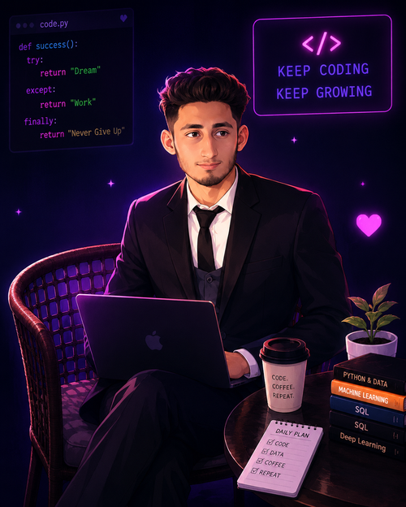

<table width="100%" style="background-color:#000000">
  <tr>
    <td align="center" width="30%" style="background-color:#000000">
      
    </td>
    <td align="center" width="70%" style="background-color:#000000">
      <h1 style="color:#06B6D4;">Rana Husnain Ali</h1>
        
      
      
      
    </td>
  </tr>
</table>

---

<table align="center">
  <tr>
    <td align="center" width="35%">
      
    </td>
    <td width="65%">
      <h3>🌟 About Me</h3>
      <ul>
        <li>📊 <b>Data Scientist</b> | Exploring Patterns, Building Smart Models</li>
        <li>🔭 Currently working on <b>Machine Learning & Deep Learning</b> models</li>
        <li>🧠 Skills: Python, SQL, Power BI, Excel, NumPy, Pandas, Scikit-Learn, Matplotlib, Seaborn</li>
        <li>⚡ Fun fact: I balance deep analytical skills with heavy lifting at the gym!</li>
        <li>📫 Email: <b>ranahasnainali.07@gamil.com</b></li>
        <li>💬 <i>"Always Learning, Always Building."</i></li>
      </ul>
    </td>
  </tr>
</table>

  

---

### 🛠️ Tech Stack & Skills
<table align="center">
  <tr>
    <td align="center" width="70"></td>
    <td align="center" width="70"></td>
    <td align="center" width="70"></td>
    <td align="center" width="70"></td>
    <td align="center" width="70"></td>
    <td align="center" width="70"></td>
    <td align="center" width="70"></td>
    <td align="center" width="70"></td>
    <td align="center" width="70"></td>
    <td align="center" width="70"></td>
    <td align="center" width="70"></td>
  </tr>
</table>

---

### 🏋️‍♂️ My Fitness & Analytics Creations
<table align="center">
  <tr>
    <th>Project / Creation</th>
    <th>Tech / Focus</th>
    <th>Status</th>
  </tr>
  <tr>
    <td>📊 Sales & Customer Churn Prediction</td>
    <td>Python, Scikit-Learn, Pandas</td>
    <td>⭐ Active</td>
  </tr>
  <tr>
    <td>💪 Gym Workout & Progress Tracker</td>
    <td>PowerBI, SQL, Excel</td>
    <td>🔥 Completed</td>
  </tr>
  <tr>
    <td>🧠 Deep Learning Image Classification</td>
    <td>Python, NumPy, Matplotlib</td>
    <td>🚀 In Progress</td>
  </tr>
</table>

---

### 📊 GitHub Stats & Graphs

  

  

  

---

### 🏆 GitHub Trophies

  

