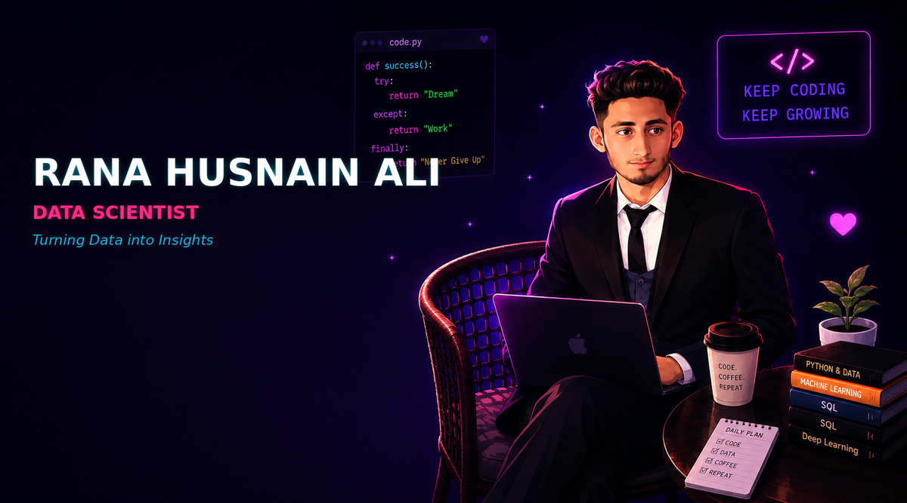
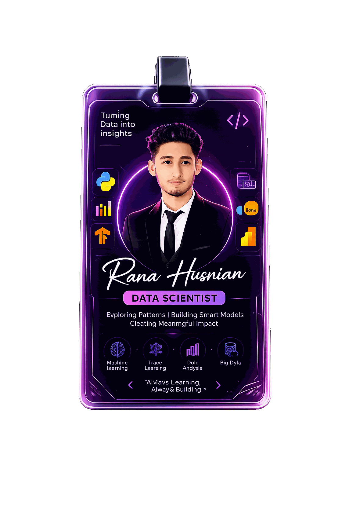
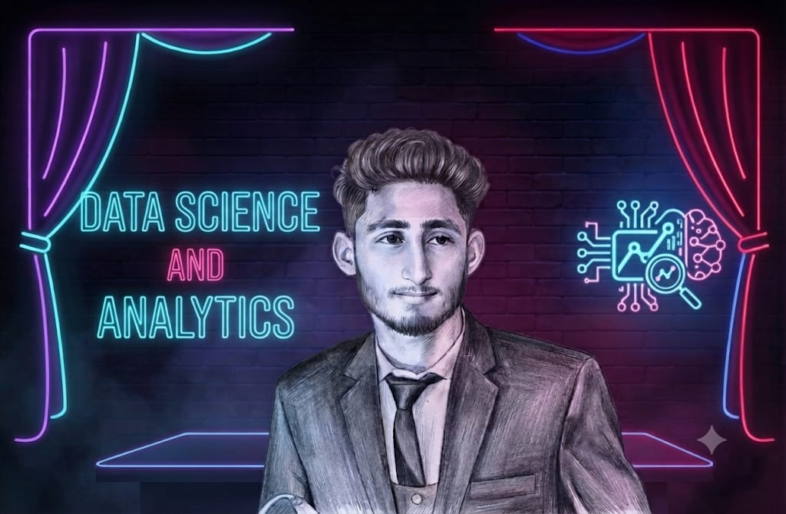

  

  
  
  
  

---

<table align="center">
  <tr>
    <td align="center" width="35%">
      
    </td>
    <td width="65%">
      <h3>🌟 About Me</h3>
      <ul>
        <li>📊 <b>Data Scientist</b> | Exploring Patterns, Building Smart Models</li>
        <li>🔭 Currently working on <b>Machine Learning & Deep Learning</b> models</li>
        <li>🎓 <b>Experience Level:</b> Fresher — eager to learn and grow</li>
        <li>🧠 Core Skills: Python, SQL, Power BI, Excel, TensorFlow, Pandas, NumPy, Scikit-Learn</li>
        <li>⚡ Fun fact: I balance deep analytical skills with heavy lifting at the gym!</li>
        <li>📫 Email: <b>ranahasnainali.07@gmail.com</b></li>
        <li>💬 <i>"Always Learning, Always Building."</i></li>
      </ul>
    </td>
  </tr>
</table>

  

---

### 🎓 Education

<table align="center">
  <tr>
    <td align="center">🏫</td>
    <td><b>BS Computer Science</b> — University of Agriculture, Faisalabad <i>Expected Graduation: 2027</i></td>
  </tr>
</table>

---

### 🛠️ Tech Stack & Skills
<table align="center">
  <tr>
    <td align="center" width="70"></td>
    <td align="center" width="70"></td>
    <td align="center" width="70"></td>
    <td align="center" width="70"></td>
    <td align="center" width="70"></td>
    <td align="center" width="70"></td>
    <td align="center" width="70"></td>
    <td align="center" width="70"></td>
    <td align="center" width="70"></td>
    <td align="center" width="70"></td>
    <td align="center" width="70"></td>
    <td align="center" width="70"></td>
  </tr>
</table>

### 📈 Skill Proficiency

   
   
   
   
   
   
   
   
   
  

---

### 🚀 Projects

<table align="center">
  <tr>
    <th>Project</th>
    <th>Description</th>
    <th>Tech Stack</th>
    <th>Link</th>
  </tr>
  <tr>
    <td>📉 <b>Customer Churn Prediction</b></td>
    <td>Predicts likelihood of customers leaving a service using classification models</td>
    <td>Python, Scikit-Learn, Pandas</td>
    <td><a href="#">🔗 Repo</a></td>
  </tr>
  <tr>
    <td>🩺 <b>Diabetes Prediction</b></td>
    <td>Machine learning model to predict diabetes risk from health indicators</td>
    <td>Python, Scikit-Learn, NumPy</td>
    <td><a href="#">🔗 Repo</a></td>
  </tr>
  <tr>
    <td>🏠 <b>Housing Price Prediction</b></td>
    <td>Regression model estimating housing prices based on property features</td>
    <td>Python, Pandas, Matplotlib</td>
    <td><a href="#">🔗 Repo</a></td>
  </tr>
</table>

<i>⚠️ Project links abhi placeholder (#) hain — apne asal repo links se update kar lein.</i>

---

### 📊 GitHub Stats & Graphs

  

  

  

---

### 🏆 GitHub Trophies

  

---

### 🐍 Contribution Snake

  

<i>⚠️ Snake animation ke liye ek chhota setup step chahiye — neeche instructions dekhein.</i>

